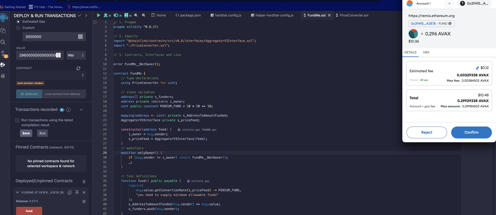
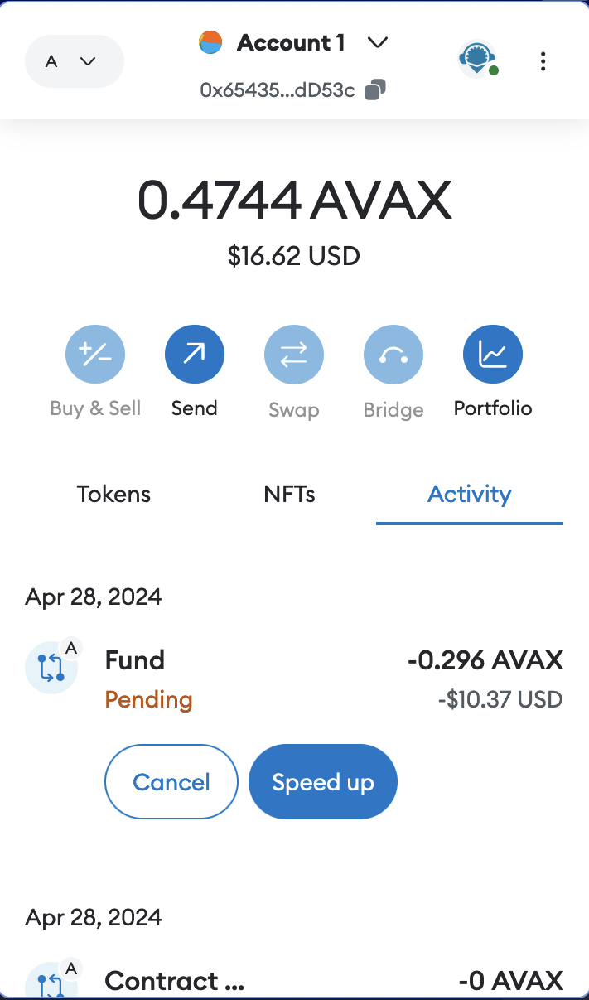
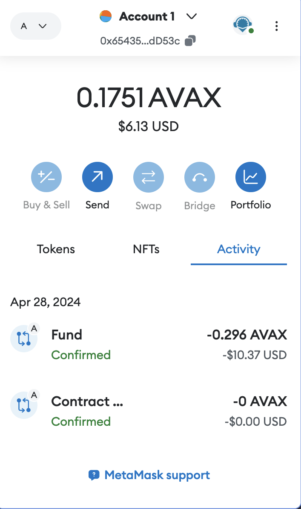

## Simple Chain link price feed with Ethereum Solidity

The project demonstrates a siimple chain link price feed for a cryptocurrency crowd funding use case. No GUI has been provided for this project however Remix IDE has been used to deploy and run the FundMe contract that implements the crowdfunding use case as shown in the subsequent workflow sections.

## Installation & Workfllow:

### Installation

0. Install NodeJS
1. Clone this repo
2. `cd chainlink-price-feed-ethereum`
3. Run the following commands to install dependencies:
   1. npm install --save-dev
4. Connect web-based Remix IDE to VS Code via remixd daemon (Google it)

### Pre requisite

Acquire AVAX token into the Avalance testnet via faucet (see )

#### How to get avax airdrop

1. Go to https://guild.xyz/avalanche to obtain a coupon code [1]
2. Go to https://core.app/tools/testnet-faucet/
3. Request 2 AVAX via the provided button using the coupon code and the destination address

### Deploy and execute crowd funding contract

0. Ensure that minimum funds provided by the faucets is specified as the FundMe contract minimum
1. A minimum fund contribution of $10 has been specified in the contract (you can to change this minimum to the minimum funds that can be provided from faucet)
2. Deploy the FundMe smart contract via Remix IDE
3. Specify the funds to deposit in WEI (here 296000000000000000) converted from $10 based on the current exchange rate provided by chainlink - this must be at least the minimum specified in the smart contract
    
4. Contract funded and account balance reduced
   

[1] How to obtain coupon code

1. Go to https://guild.xyz/avalanche
2. Follow steps in section "Get testnet AVAX"
3. For 0 AVAX balance, follow steps to the right of the panel in step 2
4. Once all steps have completed, a coupon code will display that can be used in the main setup
